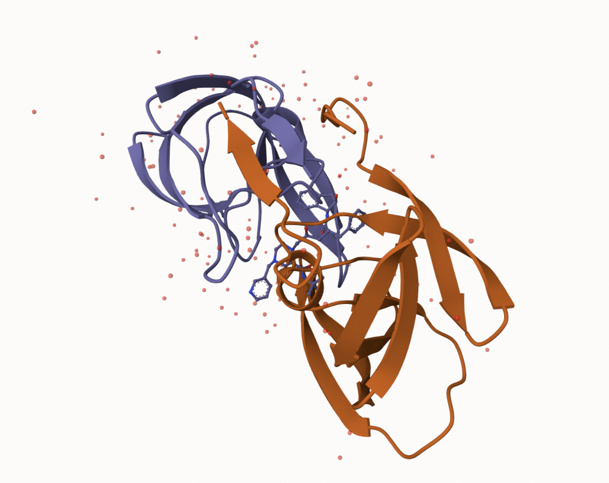

# class10
Siyu Xie (PID:A16438448)

## What’s in the PDB database

The main repository of biomolecular structure info is the PDB
\<www.rcsb.org\>. Let’s see what this database contains:

``` r
stats <- read.csv("Data Export Summary.csv",row.names=1)
stats
```

                              X.ray     EM    NMR Multiple.methods Neutron Other
    Protein (only)          163,468 13,582 12,390              204      74    32
    Protein/Oligosaccharide   9,437  2,287     34                8       2     0
    Protein/NA                8,482  4,181    286                7       0     0
    Nucleic acid (only)       2,800    132  1,488               14       3     1
    Other                       164      9     33                0       0     0
    Oligosaccharide (only)       11      0      6                1       0     4
                              Total
    Protein (only)          189,750
    Protein/Oligosaccharide  11,768
    Protein/NA               12,956
    Nucleic acid (only)       4,438
    Other                       206
    Oligosaccharide (only)       22

> Q1: What percentage of structures in the PDB are solved by X-Ray and
> Electron Microscopy.

``` r
as.numeric(stats$X.ray)
```

    Warning: NAs introduced by coercion

    [1]  NA  NA  NA  NA 164  11

``` r
as.numeric(stats$EM)
```

    Warning: NAs introduced by coercion

    [1]  NA  NA  NA 132   9   0

We got to get rid of commas. Can you find a function to get rid of
commas?

``` r
x <- stats$X.ray
sum(as.numeric(gsub(",","",x)))
```

    [1] 184362

I’m going to turn this into a function and then use `apply()` to work on
the entire table of data

``` r
sumcomma <- function(x){
  sum(as.numeric(gsub(",","",x)))
}
sumcomma(stats$X.ray)
```

    [1] 184362

``` r
n.total <- sumcomma(stats$Total)
n.total
```

    [1] 219140

``` r
sumcomma(stats$EM)
```

    [1] 20191

``` r
apply(stats, 2, sumcomma)
```

               X.ray               EM              NMR Multiple.methods 
              184362            20191            14237              234 
             Neutron            Other            Total 
                  79               37           219140 

``` r
apply(stats, 2, sumcomma)/ sumcomma(stats$Total)
```

               X.ray               EM              NMR Multiple.methods 
        0.8412978005     0.0921374464     0.0649676006     0.0010678105 
             Neutron            Other            Total 
        0.0003605001     0.0001688418     1.0000000000 

A: 84.13% percent of structures in the PDB are solved by X-Ray and 9.2%
solved by Electron Microscopy.

> Q2: What proportion of structures in the PDB are protein?

``` r
apply(stats[,-ncol(stats)], 1, sumcomma)
```

             Protein (only) Protein/Oligosaccharide              Protein/NA 
                     189750                   11768                   12956 
        Nucleic acid (only)                   Other  Oligosaccharide (only) 
                       4438                     206                      22 

``` r
apply(stats[,-ncol(stats)], 1, sumcomma)/(sumcomma(stats$Total))
```

             Protein (only) Protein/Oligosaccharide              Protein/NA 
               0.8658848225            0.0537008305            0.0591220225 
        Nucleic acid (only)                   Other  Oligosaccharide (only) 
               0.0202518938            0.0009400383            0.0001003924 

A: 86.6% of structures in the PDB are protein.

> Q3: Type HIV in the PDB website search box on the home page and
> determine how many HIV-1 protease structures are in the current PDB?

A: 26812 HIV-1 protease structures in the current PDB.

In Uniprot there are 248,805,733 entries, which, compared to PDB protein
entries (186,898), means there are only 0.07% of known sequences with a
known structure.

``` r
186898/248805733*100
```

    [1] 0.07511804

## Visualizing the HIV-1 protease structure

Mol\* (“mol-star”) viewer is now everywhere. The Mol\* homepage at
https://molstar.org/viewer/. I want to insert my image from Mol\* here.



## Working with the bio3d package

``` r
library(bio3d)
```

``` r
pdb <- read.pdb("1hsg")
```

      Note: Accessing on-line PDB file

``` r
pdb
```


     Call:  read.pdb(file = "1hsg")

       Total Models#: 1
         Total Atoms#: 1686,  XYZs#: 5058  Chains#: 2  (values: A B)

         Protein Atoms#: 1514  (residues/Calpha atoms#: 198)
         Nucleic acid Atoms#: 0  (residues/phosphate atoms#: 0)

         Non-protein/nucleic Atoms#: 172  (residues: 128)
         Non-protein/nucleic resid values: [ HOH (127), MK1 (1) ]

       Protein sequence:
          PQITLWQRPLVTIKIGGQLKEALLDTGADDTVLEEMSLPGRWKPKMIGGIGGFIKVRQYD
          QILIEICGHKAIGTVLVGPTPVNIIGRNLLTQIGCTLNFPQITLWQRPLVTIKIGGQLKE
          ALLDTGADDTVLEEMSLPGRWKPKMIGGIGGFIKVRQYDQILIEICGHKAIGTVLVGPTP
          VNIIGRNLLTQIGCTLNF

    + attr: atom, xyz, seqres, helix, sheet,
            calpha, remark, call

``` r
head(pdb$atom)
```

      type eleno elety  alt resid chain resno insert      x      y     z o     b
    1 ATOM     1     N <NA>   PRO     A     1   <NA> 29.361 39.686 5.862 1 38.10
    2 ATOM     2    CA <NA>   PRO     A     1   <NA> 30.307 38.663 5.319 1 40.62
    3 ATOM     3     C <NA>   PRO     A     1   <NA> 29.760 38.071 4.022 1 42.64
    4 ATOM     4     O <NA>   PRO     A     1   <NA> 28.600 38.302 3.676 1 43.40
    5 ATOM     5    CB <NA>   PRO     A     1   <NA> 30.508 37.541 6.342 1 37.87
    6 ATOM     6    CG <NA>   PRO     A     1   <NA> 29.296 37.591 7.162 1 38.40
      segid elesy charge
    1  <NA>     N   <NA>
    2  <NA>     C   <NA>
    3  <NA>     C   <NA>
    4  <NA>     O   <NA>
    5  <NA>     C   <NA>
    6  <NA>     C   <NA>

``` r
pdbseq(pdb)[25]
```

     25 
    "D" 

## Predicting functional motions of a single structure

We can do a bioinformatics prediction of functional motions
(i.e. flexibility/dynamics):

``` r
pdb <- read.pdb("6s36")
```

      Note: Accessing on-line PDB file
       PDB has ALT records, taking A only, rm.alt=TRUE

``` r
pdb
```


     Call:  read.pdb(file = "6s36")

       Total Models#: 1
         Total Atoms#: 1898,  XYZs#: 5694  Chains#: 1  (values: A)

         Protein Atoms#: 1654  (residues/Calpha atoms#: 214)
         Nucleic acid Atoms#: 0  (residues/phosphate atoms#: 0)

         Non-protein/nucleic Atoms#: 244  (residues: 244)
         Non-protein/nucleic resid values: [ CL (3), HOH (238), MG (2), NA (1) ]

       Protein sequence:
          MRIILLGAPGAGKGTQAQFIMEKYGIPQISTGDMLRAAVKSGSELGKQAKDIMDAGKLVT
          DELVIALVKERIAQEDCRNGFLLDGFPRTIPQADAMKEAGINVDYVLEFDVPDELIVDKI
          VGRRVHAPSGRVYHVKFNPPKVEGKDDVTGEELTTRKDDQEETVRKRLVEYHQMTAPLIG
          YYSKEAEAGNTKYAKVDGTKPVAEVRADLEKILG

    + attr: atom, xyz, seqres, helix, sheet,
            calpha, remark, call

``` r
m <- nma(pdb)
```

     Building Hessian...        Done in 0.015 seconds.
     Diagonalizing Hessian...   Done in 0.337 seconds.

``` r
plot(m)
```


``` r
mktrj(m, file="adk_m7.pdb")
```

# Comparative Analysis of Protein Structures

Here we will work through a complete pipeline of analysis for a given
protein family starting from one single database ID for a member of this
family all the way to a deeper understanding of structure, dynamics and
function.

``` r
library(bio3d)
```

``` r
id <- "1ake_A"

aa <- get.seq("1ake_A")
```

    Warning in get.seq("1ake_A"): Removing existing file: seqs.fasta

    Fetching... Please wait. Done.

``` r
aa
```

                 1        .         .         .         .         .         60 
    pdb|1AKE|A   MRIILLGAPGAGKGTQAQFIMEKYGIPQISTGDMLRAAVKSGSELGKQAKDIMDAGKLVT
                 1        .         .         .         .         .         60 

                61        .         .         .         .         .         120 
    pdb|1AKE|A   DELVIALVKERIAQEDCRNGFLLDGFPRTIPQADAMKEAGINVDYVLEFDVPDELIVDRI
                61        .         .         .         .         .         120 

               121        .         .         .         .         .         180 
    pdb|1AKE|A   VGRRVHAPSGRVYHVKFNPPKVEGKDDVTGEELTTRKDDQEETVRKRLVEYHQMTAPLIG
               121        .         .         .         .         .         180 

               181        .         .         .   214 
    pdb|1AKE|A   YYSKEAEAGNTKYAKVDGTKPVAEVRADLEKILG
               181        .         .         .   214 

    Call:
      read.fasta(file = outfile)

    Class:
      fasta

    Alignment dimensions:
      1 sequence rows; 214 position columns (214 non-gap, 0 gap) 

    + attr: id, ali, call

``` r
#b <- blast.pdb(aa)
```

``` r
#hits <- NULL
#hits$pdb.id <- c('1AKE_A','6S36_A','6RZE_A','3HPR_A','1E4V_A','5EJE_A','1E4Y_A','3X2S_A','6HAP_A','6HAM_A','4K46_A','3GMT_A','4PZL_A')
```

``` r
# Download related PDB files
#files <- get.pdb(hits$pdb.id, path="pdbs", split=TRUE, gzip=TRUE)
```

``` r
# Align releated PDBs
#pdbs <- pdbaln(files, fit = TRUE, exefile="msa")
```

print out the alignment!

``` r
#pdbs
```

``` r
# Vector containing PDB codes for figure axis
#ids <- basename.pdb(pdbs$id)

# Draw schematic alignment
#plot(pdbs, labels=ids)
```

``` r
# Perform PCA
#pc.xray <- pca(pdbs)
#plot(pc.xray)
```

``` r
# Visualize first principal component
#pc1 <- mktrj(pc.xray, pc=1, file="pc_1.pdb")
```
